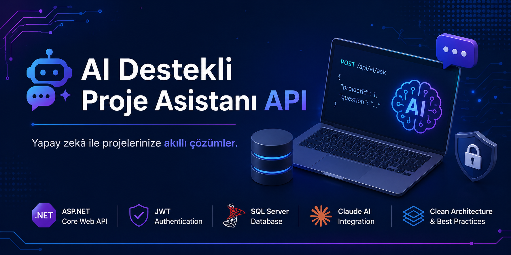
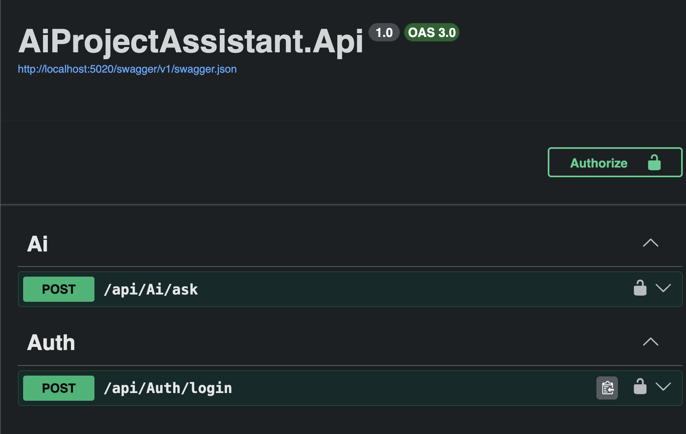
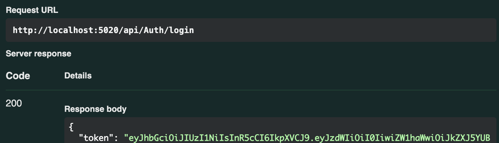
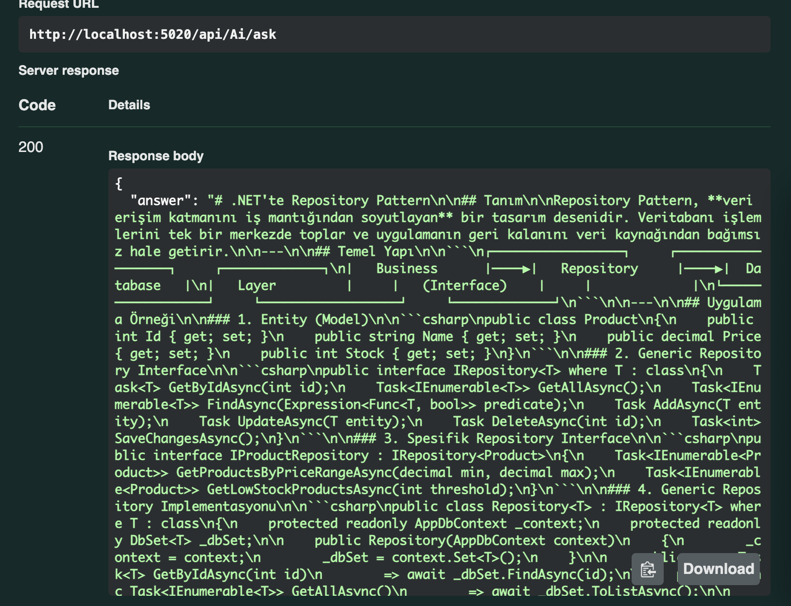
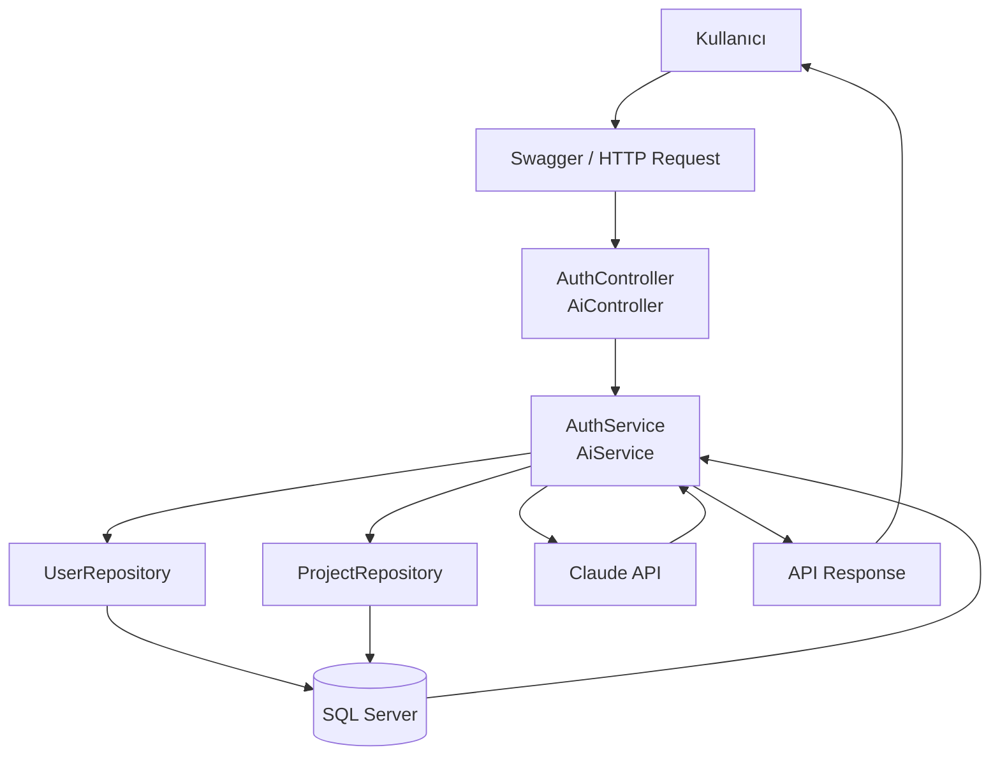
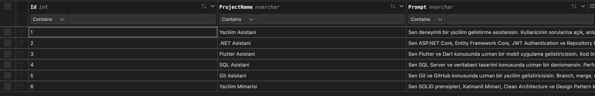
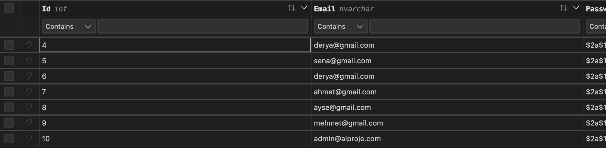

<p align="center">
    
</p>

# 🤖 AI Destekli Proje Asistanı API

<p align="center">
ASP.NET Core Web API • JWT Authentication • SQL Server • Claude AI
</p>


## 📑 İçindekiler

- [📖 Proje Hakkında](#-proje-hakkında)
- [🚀 Temel Özellikler](#-temel-özellikler)
- [🔄 Proje Akışı](#-proje-akışı)
- [🏗 Katmanlı Mimari](#-katmanlı-mimari)
- [📁 Proje Yapısı](#-proje-yapısı)
- [📷 Swagger Arayüzü](#-swagger-arayüzü)
- [🔐 Kullanıcı Girişi](#-kullanıcı-girişi)
- [🤖 Yapay Zekâ Sorgusu](#-yapay-zekâ-sorgusu)
- [🏛 Sistem Mimarisi](#-sistem-mimarisi)
- [📊 Veritabanı Tasarımı](#-veritabanı-tasarımı)
- [🔒 Güvenlik](#-güvenlik)
- [👨‍💻 Geliştirici](#-geliştirici)


> ASP.NET Core Web API kullanılarak geliştirilen, JWT Authentication ile korunan ve Claude AI entegrasyonuna sahip katmanlı mimariye uygun örnek bir projedir.

---

## 📖 Proje Hakkında

Bu proje, kullanıcıların sisteme güvenli bir şekilde giriş yaptıktan sonra seçtikleri proje kapsamında yapay zekâ ile iletişim kurmasını sağlayan bir Web API uygulamasıdır.

Her proje için veritabanında farklı bir sistem promptu tanımlanabilir. Kullanıcı soru sorduğunda ilgili prompt okunur ve Claude API'ye gönderilerek cevap üretilir.

---

## 🚀 Temel Özellikler

- 🔐 JWT Authentication
- 🤖 Claude AI Entegrasyonu
- 🗄 SQL Server Veritabanı
- 📚 Entity Framework Core
- 🏗 Katmanlı Mimari
- 📦 Repository Pattern
- ⚙️ Dependency Injection
- 📄 Swagger Desteği
- 🔧 Options Pattern
- 🔄 Genişletilebilir AI Provider Yapısı

---

## 🔄 Proje Akışı

```text
Kullanıcı
    │
    ▼
POST /api/Auth/login
    │
    ▼
JWT Token
    │
    ▼
POST /api/Ai/ask
    │
    ▼
AiController
    │
    ▼
AiService
    │
    ▼
ProjectRepository
    │
    ▼
SQL Server
(Proje Promptu)
    │
    ▼
Claude API
    │
    ▼
Yapay Zekâ Cevabı
    │
    ▼
Kullanıcı
```

---

## 🏗 Katmanlı Mimari

Proje SOLID prensipleri dikkate alınarak katmanlı mimariye uygun şekilde geliştirilmiştir.

```text
Controllers
     │
     ▼
Services
     │
     ▼
Repositories
     │
     ▼
Entity Framework Core
     │
     ▼
SQL Server
```

Her katmanın yalnızca kendi sorumluluğunu yerine getirmesi hedeflenmiştir. Böylece uygulama daha okunabilir, sürdürülebilir ve geliştirilebilir hale gelmiştir.

---

## 📁 Proje Yapısı

```text
AiProjectAssistant
│
├── src
│   └── AiProjectAssistant.Api
│       ├── Controllers
│       ├── Data
│       ├── DTOs
│       ├── Entities
│       ├── Extensions
│       ├── Middleware
│       ├── Options
│       ├── Repositories
│       ├── Services
│       ├── Program.cs
│       └── appsettings.json
│
├── README.md
└── .gitignore
```

---

## 📷 Swagger Arayüzü

API endpointleri Swagger üzerinden kolayca görüntülenebilir ve test edilebilir. Projede iki temel endpoint bulunmaktadır:

- **POST /api/Auth/login** → Kullanıcı girişi yaparak JWT Token oluşturur.
- **POST /api/Ai/ask** → Kimliği doğrulanmış kullanıcının yapay zekâya soru göndermesini sağlar.

<p align="center">
    
</p>

---

## 🔐 Kullanıcı Girişi

Kullanıcı, e-posta ve şifre bilgileriyle sisteme giriş yapar. Bilgiler doğrulandığında API tarafından bir JWT (JSON Web Token) oluşturulur. Bu token, korumalı endpointlere erişim sağlamak için `Authorization` başlığı ile gönderilir.

<p align="center">
    
</p>

---

## 🤖 Yapay Zekâ Sorgusu

Kimliği doğrulanmış kullanıcı, seçtiği proje kapsamında yapay zekâya soru gönderebilir. API, ilgili projenin sistem promptunu veritabanından okur ve kullanıcı sorusuyla birlikte Claude API'ye iletir. Üretilen cevap kullanıcıya JSON formatında döndürülür.

<p align="center">
    
</p>

---

## 🏛 Sistem Mimarisi

Aşağıdaki diyagram, kullanıcı isteğinin sistem içerisinde nasıl işlendiğini göstermektedir.



---

## 📊 Veritabanı Tasarımı

Projede **SQL Server** veritabanı kullanılmaktadır. Kullanıcı bilgileri ve yapay zekâ projelerine ait sistem promptları iki temel tablo üzerinde tutulmaktadır.

### Users

| Alan | Tip | Açıklama |
|------|-----|----------|
| Id | int | Kullanıcı kimliği |
| Email | nvarchar | Kullanıcı e-posta adresi |
| PasswordHash | nvarchar | BCrypt ile şifrelenmiş parola |

### Projects

| Alan | Tip | Açıklama |
|------|-----|----------|
| Id | int | Proje kimliği |
| ProjectName | nvarchar | Proje adı |
| Prompt | nvarchar(max) | Yapay zekâ için kullanılan sistem promptu |

#### Örnek Kayıtlar

Uygulamanın test edilmesi amacıyla veritabanına örnek kullanıcılar ve farklı uzmanlık alanlarını temsil eden proje kayıtları eklenmiştir. Her proje, kendine ait bir sistem promptu ile yapay zekânın farklı konularda cevap üretmesini sağlamaktadır.

**Projects Tablosu**

<p align="center">
    
</p>

**Users Tablosu**

<p align="center">
    
</p>

---

## 🔒 Güvenlik

Projede temel güvenlik önlemleri uygulanmıştır.

- Kullanıcı parolaları **BCrypt** algoritması ile hash'lenerek saklanmaktadır.
- Kimlik doğrulama işlemleri **JWT Bearer Authentication** kullanılarak gerçekleştirilmektedir.
- Korumalı endpointlere yalnızca doğrulanmış kullanıcılar erişebilmektedir.
- Hassas bilgiler (Connection String, JWT Key ve Claude API Key) **User Secrets** kullanılarak kaynak kodundan ayrı tutulmaktadır.
---

## ⚙️ Kurulum

### 1. Projeyi klonlayın

```bash
git clone https://github.com/derya003/AiProjectAssistant.git
```

### 2. Proje klasörüne geçin

```bash
cd AiProjectAssistant
```

### 3. Gerekli paketleri yükleyin

Projeyi Visual Studio 2022 veya .NET CLI ile açabilirsiniz.

### 4. Veritabanı bağlantısını yapılandırın

`appsettings.json` dosyasında bulunan SQL Server bağlantı bilgisini kendi veritabanınıza göre düzenleyin.

```json
"ConnectionStrings": {
  "DefaultConnection": "Server=.;Database=AiProjectAssistantDb;Trusted_Connection=True;TrustServerCertificate=True;"
}
```

### 5. Veritabanını oluşturun

```bash
dotnet ef database update
```

### 6. Uygulamayı çalıştırın

```bash
dotnet run
```

veya Visual Studio üzerinden **Start** butonuna basarak çalıştırabilirsiniz.

### 7. Swagger arayüzüne erişin

Uygulama çalıştıktan sonra aşağıdaki adrese giderek API'yi test edebilirsiniz.

```
https://localhost:xxxx/swagger/index.html
```

> Port numarası Visual Studio tarafından otomatik olarak belirlenmektedir.

## 🌐 Canlı Demo

Uygulamanın yayınlanmış sürümüne aşağıdaki adresten erişebilirsiniz.

```
http://aiprojeassistant.runasp.net/swagger/index.html
```
## 🔑 Test Kullanıcısı

Swagger üzerinden aşağıdaki bilgiler ile giriş yapabilirsiniz.

| Alan | Değer |
|------|--------|
| E-posta | derya@gmail.com |
| Şifre | 123456 |

Başarılı girişten sonra dönen JWT Token, Swagger üzerindeki **Authorize** bölümüne eklenerek korumalı endpointler test edilebilir.  

## 👨‍💻 Geliştirici

Bu proje, staj süreci kapsamında ASP.NET Core Web API, SQL Server, JWT Authentication ve Claude AI entegrasyonu konularında deneyim kazanmak amacıyla geliştirilmiştir.

**Geliştirici:** Derya Durgun

---

⭐ Bu proje eğitim ve staj çalışması kapsamında geliştirilmiştir.